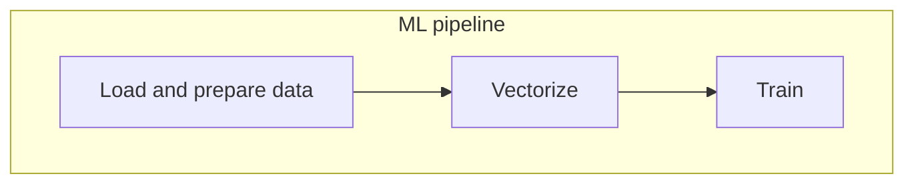

# Introduction to MLOps

_[Video source](https://www.youtube.com/watch?v=s0uaFZSzwfI&list=PL3MmuxUbc_hIUISrluw_A7wDSmfOhErJK&index=2)_

***MLOps*** is a _set of best practices_ for bringing Machine Learning to production.

Machine Learning projects can be simpplified to just 3 steps:

1. ***Design*** - is ML the right tool for solving our problem?
   * _We want to predict the duration of a taxi trip. Do we need to use ML or can we used a simpler rule-based model?_
2. ***Train*** - if we do need ML, then we train and evaluate the best model.
3. ***Operate*** - model deployment, management and monitoring.

MLOps is helpful in all 3 stages.

# Environment setup

_[Video source](https://www.youtube.com/watch?v=IXSiYkP23zo&list=PL3MmuxUbc_hIUISrluw_A7wDSmfOhErJK&index=3)_

You may check the link above to watch the video in order to learn how to set up a Linux VM instance in Amazon Web Services.

If you'd rather work with Google Cloud Platform, you may check out [the instructions in this gist](https://gist.github.com/ziritrion/3214aa570e15ae09bf72c4587cb9d686). Please note that the gist was meant for the [Data Engineering Zoomcamp](https://github.com/DataTalksClub/data-engineering-zoomcamp) and assumes that the reader has some familiarity with GCP and Linux shell commands. You may check out [my Data Engineering Zoomcamp notes](https://github.com/ziritrion/dataeng-zoomcamp/blob/main/notes/1_intro.md#terraform-and-google-cloud-platform) for a refresher on GCP.

Alternatively, you may also use any other cloud vendor or set up a local environment. The requirements for this course are:

* [Docker](https://www.docker.com/) and [Docker Compose](https://docs.docker.com/compose/)
  * If you're using a local environment with a GUI, then [Docker Desktop](https://www.docker.com/products/docker-desktop/) is the recommended download for both components.
* [Anaconda](https://www.anaconda.com/)
  * We will use Python 3.9 for this course.
  * We will also need Jupyter Notebook.
  * You may check out my [Python environments cheatsheet](https://gist.github.com/ziritrion/8024025672ea92b8bdeb320d6015aa0d) for a refresher on how to use Anaconda to install Python.
* (Optional) [Visual Studio Code](https://code.visualstudio.com/) and the [Remote - SSH](https://marketplace.visualstudio.com/items?itemName=ms-vscode-remote.remote-ssh) extension
  * These requirements are not necessary but they make it much easier to connect to remote instances and redirect ports. These notes will assume that you're using both.

>Note: Any additional requirements will be listed as needed during the course.

# (Optional) Training a model from scratch and reading parquet files

This course builds on the [Machine Learning Zoomcamp](https://github.com/alexeygrigorev/mlbookcamp-code/tree/master/course-zoomcamp) and the [Data Engineering Zoomcamp](https://github.com/DataTalksClub/data-engineering-zoomcamp), so for brevity these notes will not cover content that has already been covered there. You may check out my notes for reference:
* [Notes for Machine Learning](https://github.com/ziritrion/ml-zoomcamp)
* [Notes for Data Engineering](https://github.com/ziritrion/dataeng-zoomcamp)

The following videos show how to train a model for the purpose of using it later in the course. They use the [New York City's TLC Trip Record Data](https://www1.nyc.gov/site/tlc/about/tlc-trip-record-data.page) for training. You may skip them if you're already familiar with the previous zoomcamps, but the videos link nicely into the next section and illustrate the purpose of the coourse's contents.

* [Training a model video](https://www.youtube.com/watch?v=iRunifGSHFc&list=PL3MmuxUbc_hIUISrluw_A7wDSmfOhErJK&index=6)
* [Reading parquet files video](https://www.youtube.com/watch?v=r94QjpX9vSE&list=PL3MmuxUbc_hIUISrluw_A7wDSmfOhErJK&index=4)

You may also access the resulting files from the following links:

* [duration-prediction.ipynd](https://github.com/DataTalksClub/mlops-zoomcamp/blob/main/01-intro/duration-prediction.ipynb)

# Course overview

_[Video source](https://www.youtube.com/watch?v=teP9KWkP6SM&list=PL3MmuxUbc_hIUISrluw_A7wDSmfOhErJK&index=6)_

When data scientists experiment with Jupyter Notebooks for creating models, they often don't follow best practices and are often unstructured due to the nature of experimentation: cells are re-run with slightly different values and previous results may be lost, or the cell execution order may be inconsistent, for example.

***Module 2*** covers ***experiment tracking***: by using tools such as [MLflow](https://mlflow.org/) we will create ***experiment trackers*** (such as the history of cells that we've rerun multiple times) and ***model registries*** (for storing the models we've created during the experiments), instead of relying on our memory or janky setups such as external spreadsheets or convoluted naming schemes for our files.

***Module 3*** covers ***orchestration and ML pipelines***: by using tools such as [Prefect](https://www.prefect.io/) and [Kubeflow](https://www.kubeflow.org/) we can break down our notebooks into separate identifyable steps and connect them in order to create a ***ML pipeline*** which we can parametrize with the data and models we want and easily execute.

***Module 4*** covers ***serving the models***: we will learn how to deploy models in different ways.

***Module 5*** covers ***model monitoring***: we will see how to check whether our model is performing fine or not and how to generate alers to warn us of performance drops and failures, and even automate retraining and redeploying models without human input.

***Module 6*** covers ***best practices***, such as how to properly maintain and package code, how to deploy successfully, etc.

***Module 7*** covers ***processes***: we will see how to properly communicate between all the stakeholders of a ML project (scientists, engineers, etc) and how to work together.

# Maturity model